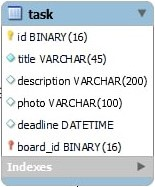
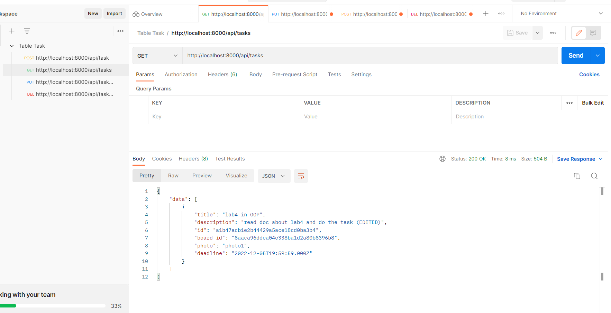

# Тестування працездатності системи

\**В цьому розділі необхідно вказати засоби тестування, навести вихідні коди тестів та результати тестування.*\*

Тестування відбувалося за допомогою програми "Postman". Нижче наведені результати тестування методів get, post, put і delete. 

В якості курсової робити було реалізовано таблицю **Task**

*Варто зауважити, що на час тестування була відключена перевірка існування зовнішного ключа (foreign key) board_id через те, що таблиця board пуста.*

**Запуск сервера**
---

**Get Tasks**
---
Повна таблиця Tasks на початку. Тестування виводу всіх сутностей.

**Post Task**
---
Запис нової сутності

Перевірка результату

**Put and Get Task by ID**
---
Редагування полей одного із сутностей по ID

Перевірка результату. Вивід сутності по ID

**Delete Task by ID**
---
Видалення сутності

Вибір ID

Видалення

Перевірка результату

